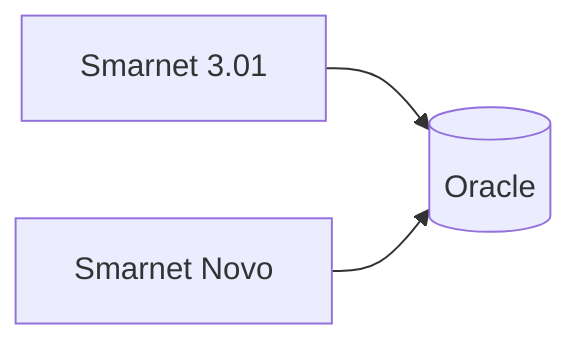

# Documentação do Sistema

Documentação de produto, domínio e operação do Smarnet ERP.
O **Design System** (componentes/UI) permanece separado em `/design-system` no app. Agentes: [developers/design-system.md](./developers/design-system.md).

Idioma: **português**. Quando a documentação estiver madura, migrar para inglês.

## Destinos

| Pasta | Público |
|-------|---------|
| [developers/](./developers/) | Desenvolvedores e agentes de IA |
| [admins/](./admins/) | Administradores / TI |
| [operators/](./operators/) | Operadores do ERP |

Inventário de stack/infra (versões): [developers/stack-e-infraestrutura.md](./developers/stack-e-infraestrutura.md).

## Domínio e agentes

- Glossário de domínio: [`CONTEXT.md`](../CONTEXT.md) (raiz do repositório)
- Roteiro para agentes: [`AGENTS.md`](../AGENTS.md)
- Decisões de arquitetura (ADRs): [`adr/`](./adr/)

## Hub in-app

Disponível em **`/docs`** para superusuário em ambiente de desenvolvimento (layout no estilo Design System; menu = árvore de `docs/`).

## Diagramas (Mermaid)

Use blocos fenced `mermaid` para fluxogramas, sequência, ER e gráficos. O hub `/docs` renderiza com a lib `mermaid` (claro/escuro). GitHub e o preview do editor também entendem o mesmo bloco.

Sintaxe: [mermaid.js.org](https://mermaid.js.org/intro/). Preferir `flowchart`, `sequenceDiagram` e `erDiagram`. Labels com espaço ou pontuação vão entre aspas (`A["USU_CHAPA"]`). Não usar HTML dentro do diagrama (`securityLevel: strict` no hub).

