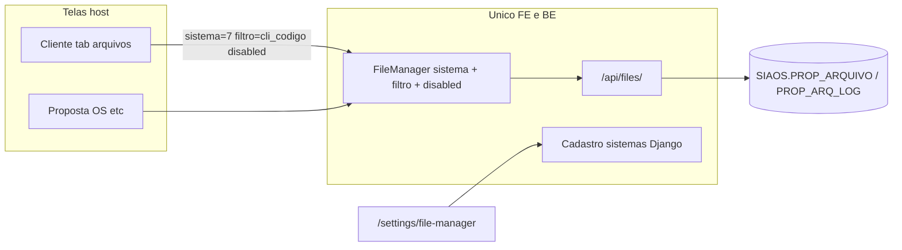

# Gerenciador de Arquivos

Componente compartilhado do Smarnet Novo que replica o gerenciador do **Smarnet 3.01** (`dqanet/filemanager` / `ss3/complemento/arquivo_lista.php`). O host **não** implementa arquivos: só passa `sistema`, `filtro` e `disabled` (`desabilita` 0/1).

Ver glossário: **Gerenciador de Arquivos**, **PAR_SISTEMA**, **PAR_FILTRO**, **desabilita** em [`CONTEXT.md`](../../CONTEXT.md).

## Como embutir

```tsx
import { FileManager } from '@/modules/files';
import { SISTEMA_CLIENTE } from '@/modules/files/sistemas';

<FileManager
  sistema={SISTEMA_CLIENTE}
  filtro={String(cliente.codigo)}
  disabled={!canChange}
/>
```

| Prop | 3.01 | O que é |
|------|------|---------|
| `sistema` | `PAR_SISTEMA` (`op_file`) | Código do cadastro em `/settings/file-manager` |
| `filtro` | `PAR_FILTRO` | PK do registro host, varchar |
| `disabled` | `desabilita` (`0`/`1`) | `1` / `true` bloqueia incluir, alterar e excluir (pasta, upload, mover, apagar). Listar, baixar e histórico seguem ativos |

Toda query/escrita/log usa **os dois**. Sem os dois a árvore fica vazia (igual `dtree.php`). `PAR_CODIGO` é a PK da linha em `SIAOS.PROP_ARQUIVO`, não o filtro.

## Seed `PAR_SISTEMA` (3.01)

Códigos **1–12** nascem no seed Django; **imutáveis** depois de criados. Novos códigos a partir de **13**.

| Código | Nome |
|--------|------|
| 1 | Proposta |
| 2 | Revisor / OS |
| 3 | Usado |
| 4 | Processo |
| 5 | Oportunidade |
| 6 | Laudo |
| **7** | **Cliente** (`SIAOS.CLIENTE.CODIGO`) |
| 8 | Compras — Indicadores |
| 9 | Pedido — Faturamento |
| 10 | Nota Fiscal |
| 11 | Nota Fiscal (entrada) |
| 12 | Estrutura de produto |

A tela `/settings/file-manager` é o mapa desses vínculos: **sistema** (host) × **código do gerenciador** (`PAR_SISTEMA`), com a chave `PAR_FILTRO` e a tela no Novo quando já existir (hoje: Cliente).

## Persistência (duas vias)

Seguir [`novas-telas.md`](./novas-telas.md) + [ADR 0005](../adr/0005-escrita-oracle-reuso-ou-python.md). Contexto: `backend/apps/files/` (não misturar com `administracao`).

1. **Catálogo de sistemas** — aplicação **nativa**, ORM no alias `default` (tabela `ARQUIVOS_SISTEMA`). Aplicar `python manage.py migrate files_infrastructure` no ambiente; sem a tabela a árvore ainda lê `PROP_ARQUIVO`, mas o rótulo raiz cai no código numérico e o Settings não lista os vínculos.
2. **Arquivos** — tela **migrada**, DML Python no alias `smar` (via 2). O package do 3.01 **não** grava BLOB; `SP_MSG_ARQUIVO` manda e-mail e resolve usuário por `USER` — **não reusar**. `SELECT MAX(PAR_CODIGO)+1` vira lock + `MAX` no repositório.

Tabelas (já existem; scripts de leitura em `docs/_scripts/tables/`):

- `SIAOS.PROP_ARQUIVO` — pastas (`PAR_TIPO=0`) e arquivos (`PAR_TIPO=1`); BLOB em `PAR_ARQUIVO`; lixeira em `PAR_LIXEIRA`; pasta fixa `PAR_PASTA_FIXA=1`.
- `SIAOS.PROP_ARQ_LOG` — histórico (`INSERT` / `MOVE` / `UPDATE` / `DELETE` / `RESTORE`). Download **não** gera log (insert comentado no 3.01).
- `SMARNET.LEGENDA` / `LEGENDA_TEXTO` — i18n das pastas-modelo (`NVL(texto, PAR_NOME)`). Insert manual v1 deixa `LEG_*` nulo.

Grants: [`grants-oracle-arquivos.md`](../admins/grants-oracle-arquivos.md).

## API `/api/files/`

| Método | Path | Uso |
|--------|------|-----|
| GET/POST | `/sistemas/` | Settings (`IsAccessAdmin`) |
| GET/PUT | `/sistemas/<codigo>/` | Settings; `codigo` imutável |
| GET | `/tree/?sistema=&filtro=` | Árvore (pastas + arquivos + lixeira) |
| POST | `/folders/` | Nova pasta |
| POST | `/files/` | Upload multipart (BLOB) |
| POST | `/nodes/<par_codigo>/move/` | Move / rename |
| GET | `/nodes/<par_codigo>/download/?sistema=&filtro=` | Stream |
| POST | `/nodes/trash/` | Lixeira (`PAR_LIXEIRA = SYSDATE`); recusa `PAR_PASTA_FIXA=1` |
| GET | `/historico/?sistema=&filtro=` | `PROP_ARQ_LOG` + `USUARIO.USU_NOME` |

Perms do gerenciador: `files_infrastructure.view/add/change/delete_arquivo`. Na aba Cliente a UI usa `view_cliente` / `change_cliente` (`disabled={!canChange}`); o operador também precisa das perms de arquivo.

## Toolbar 3.01 → componente

| Botão 3.01 | Ação |
|------------|------|
| Apagar Arquivos | Lixeira (`PAR_LIXEIRA`) |
| Anexar Arquivos | Modal upload (`FormFileUpload`) |
| Nova Pasta | Modal pasta (nome, descrição máx. 60, pai, grupo `Todos`) |
| Mover | Modal destino (Inserir/Sair) |
| Historico | Modal log |

Árvore: raiz `NomeDoSistema: {filtro}`; pasta com descrição em itálico entre aspas; arquivo com data/tamanho Kb; texto `text-accent` se `ACE_CODIGO` (restrição); nó **Lixeira** no rodapé. Clique no arquivo baixa.

## Fora desta entrega (v2)

- Restaurar da lixeira; `conf=1` / `PROP_ARQ_MOD`; `PCK_SMART_SALES3.SP_PASTAS_AUTOMATICAS`.
- ACL completo de `SMARNET.ACESSO` (v1: Grupo = **Todos** / `ACE_CODIGO` nulo).
- Desligar o PHP — só no go-live ([ADR 0006](../adr/0006-desativacao-legado-por-modulo.md)).
- Novos hosts (Proposta `sistema=1`, OS `=2`) até existirem no Novo.


