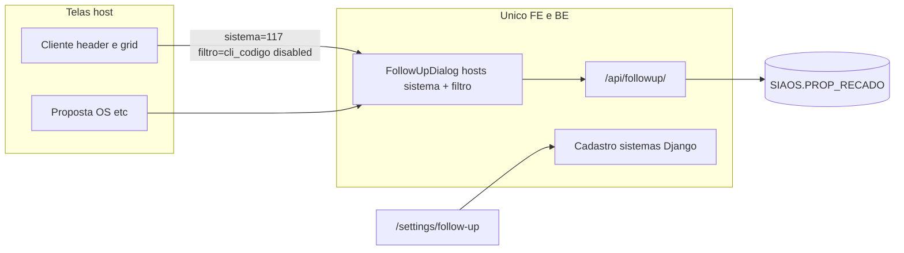

# Follow-up (recado)

Componente compartilhado do Smarnet Novo que replica o follow-up **genérico** do **Smarnet 3.01** (`ss3/recado/recado.php`, aberto via `recadoJQ(filtro, sistema)`). O host **não** implementa recados: só passa `sistema`, `filtro` e `disabled`.

Ver glossário: **Follow-up**, **PRE_SISTEMA**, **PRE_FILTRO** em [`CONTEXT.md`](../../CONTEXT.md). Não confundir com o [Gerenciador de Arquivos](./arquivos.md) (`PAR_SISTEMA=7` no Cliente).

## Cliente: dois follow-ups no 3.01

No cadastro de Cliente o 3.01 tinha **duas** telas:

| Tela 3.01 | Persistência | No Novo |
|-----------|--------------|---------|
| Follow-up **genérico** (`recado.php` / `PROP_RECADO`, `PRE_SISTEMA=117`) | `SP_GRAVA_FOLLOWUP` | **Esta tela** (header da ficha + menu ⋮ da listagem) |
| Follow-up **específico** do Cliente (post-it / `FOLLOW_CLIENTE`) | `SP_UPDATE_FOLLOWUP` | **Descontinuado** — não apresentar |

A API `/cliente-notes/` ainda existe no backend; nenhum host deve embutir essa UI.

## Abas (vários follow-ups abertos)

O modal genérico tem **abas** porque o operador pode manter mais de um follow-up aberto ao mesmo tempo (como o 3.01). Cada aba é um host (`sistema` + `filtro`); o rótulo segue `{nome}: {filtro}` (ex.: `Cliente: 5415`).

Na listagem de Clientes, **Follow-up** no menu ⋮ **acrescenta** uma aba se aquele cliente ainda não estiver no modal, e a foca. Fechar (Cancelar) limpa todas as abas.

## Como embutir

```tsx
import { FollowUpTrigger } from '@/modules/followup';
import { SISTEMA_CLIENTE_FOLLOWUP } from '@/modules/followup/sistemas';

<FollowUpTrigger
  sistema={SISTEMA_CLIENTE_FOLLOWUP}
  filtro={String(cliente.codigo)}
  disabled={!editing}
/>
```

`FollowUp` (painel) também pode ir em aba/dialog próprio. No Cliente v1 o gatilho é **modal no header** (`FollowUpTrigger`) e também no menu ⋮ da listagem (`FollowUpDialog` com `hosts[]`).

```tsx
<FollowUpDialog
  open={open}
  onOpenChange={setOpen}
  hosts={hosts}
  activeHostKey={activeKey}
  onActiveHostKeyChange={setActiveKey}
/>
```

| Prop | 3.01 | O que é |
|------|------|---------|
| `sistema` | `sit_codigo` / `PRE_SISTEMA` | Código do cadastro em `/settings/follow-up` |
| `filtro` | `PRE_FILTRO` | PK do registro host (INTEGER no Oracle; a API envia string) |
| `disabled` | tela em visualizar | `true` bloqueia incluir, alterar e baixa; listar continua |
| `hosts` | abas do `recado.php` | Lista de `{ sistema, filtro, disabled? }` no `FollowUpDialog` |

Toda lista/gravação usa **os dois** (`PRE_SISTEMA` + `PRE_FILTRO`). Sem os dois a lista fica vazia. `PRE_CODIGO` é a PK da linha em `SIAOS.PROP_RECADO`, não o filtro.

## Seed `PRE_SISTEMA` (3.01 `sit_codigo`)

Códigos **3, 117, 121, 281, 292** nascem no seed Django; **imutáveis** depois de criados. Novos códigos a partir de **300**.

| Código | Nome | Tela no Novo |
|--------|------|----------------|
| 3 | Consulta / OS | Reservado (3.01) |
| **117** | **Cliente** (`SIAOS.CLIENTE.CODIGO`) | Cadastro de clientes — modal no header e no ⋮ da listagem |
| 121 | Proposta — Order IN | Ainda no PHP 3.01 (v1 sem embed) |
| 281 | SiGO | Reservado (3.01) |
| 292 | Revisões | Reservado (3.01) |

A tela `/settings/follow-up` é o mapa desses vínculos: **sistema** (host) × **código do follow-up** (`PRE_SISTEMA`), com a chave `PRE_FILTRO` e a tela no Novo quando já existir (hoje: Cliente).

O package infere `PRE_SISTEMA` de `TIPO_RECADO.TRE_SISTEMA` (não do parâmetro `sistema` da API). `TRE_SISTEMA` é lista separada por vírgula (`0` = todos os sistemas). Se o host não tiver nenhum tipo ativo, a Referência cai no **38 — Outros**.

## Persistência

Seguir [`novas-telas.md`](./novas-telas.md) + [ADR 0005](../adr/0005-escrita-oracle-reuso-ou-python.md). Contexto: `backend/apps/followup/` (não misturar com `commercial` nem com `files`).

1. **Catálogo de sistemas** — aplicação **nativa**, ORM no alias `default` (tabela `FOLLOWUP_SISTEMA`). Aplicar `python manage.py migrate followup_infrastructure` no ambiente.
2. **Recados estruturados** — tela **migrada**, `callproc` `SIAOS.PCK_SMART_SALES3.SP_GRAVA_FOLLOWUP` (op 1 insert / 2 update / 3 baixa). Sem DML direto em `PROP_RECADO`.

Tabelas (já existem; scripts de leitura em `docs/_scripts/tables/`):

- `SIAOS.PROP_RECADO` — recado (`PRE_MENSAGEM` CLOB; alerta `PRE_DT_ALARM`; baixa `PRE_DT_BAIXA`).
- `SIAOS.TIPO_RECADO` — referência (`TRE_ATIVO=1`; `TRE_SISTEMA` lista CSV de `sit_codigo`, `0` = todos; rótulo `TRE_DESCRICAO`). Sem tipo do host: **38 Outros**.
- `SIAOS.MOTIVO` — motivos de encerramento (`MOT_DESCRICAO`).
- `SIAOS.USUARIO` — autor do recado.

`SIAOS.FOLLOW_CLIENTE` é o follow-up específico do Cliente (descontinuado na UI). Grants e API de notas legado permanecem por compatibilidade; não usar no produto.

Grants: [`grants-oracle-followup.md`](../admins/grants-oracle-followup.md).

## API `/api/followup/` (alias `/api/recados/`)

| Método | Path | Uso |
|--------|------|-----|
| GET/POST | `/sistemas/` | Settings (`IsAccessAdmin`) |
| GET/PUT | `/sistemas/<codigo>/` | Settings; `codigo` imutável |
| GET | `/items/?sistema=&filtro=` | Lista (`TRE` 1, 2, 10, 19 ocultos; ordem tipo 9 depois `PRE_DATA DESC`) |
| POST | `/items/` | Grava (201 insert / 204 update) |
| POST | `/items/<pre_codigo>/baixa/?sistema=&filtro=` | Baixa alerta (op 3) |
| GET | `/tipos/?sistema=` | Combo Referência (`TRE_ATIVO=1`; rótulo `TRE_DESCRICAO`; fallback **38**) |
| GET | `/motivos/` | Motivos (`TRE_TIPO_CANC=1`); rótulo `MOT_DESCRICAO` |
| GET | `/status/?sistema=&filtro=` | Ícone none / ok / warning |
| GET/POST | `/cliente-notes/` | Follow-up específico Cliente (`FOLLOW_CLIENTE`) — **não usar na UI** |

Perms: `followup_infrastructure.view/add/change/delete_recado`. No header Cliente a UI usa o modo editar da ficha (`disabled={!editing}`); o operador também precisa das perms de recado.

## Comportamento 3.01 → componente

| Recado.php | Ação |
|------------|------|
| Abas | Uma por host aberto (`Cliente: {codigo}`); na grid, ⋮ acrescenta aba |
| Referência | Filtro da lista: **Todos** (sem `tre` na API) ou um `TIPO_RECADO` (`TRE_DESCRICAO`); **Novo** exige referência específica |
| Motivo | Obrigatório se `TRE_TIPO_CANC=1`; catálogo `SIAOS.MOTIVO` (`MOT_DESCRICAO`) |
| Novo Follow-up | Substitui a lista: mensagem, Alarme, Hora (30 min) e Inserir; Cancelar só no rodapé do modal. Motivo se `TRE_TIPO_CANC` |
| Alterar | Só o autor (`usu_chapa`); newlines → `<br />` na gravação |
| Baixar alerta | Qualquer um com `change_recado` |
| Ícone status | none / ok / warning (alarme aberto até `SYSDATE+3`) |
| Cancelar | Fecha o modal e descarta as abas abertas |

## Fora desta entrega (v2)

- Host Proposta `121` (`SP_CANCELA_PROPOSTA`, `PRP_PROB_VENDA`).
- `FOLLOW_OS` / item / controle.
- Desligar o PHP — só no go-live ([ADR 0006](../adr/0006-desativacao-legado-por-modulo.md)).


