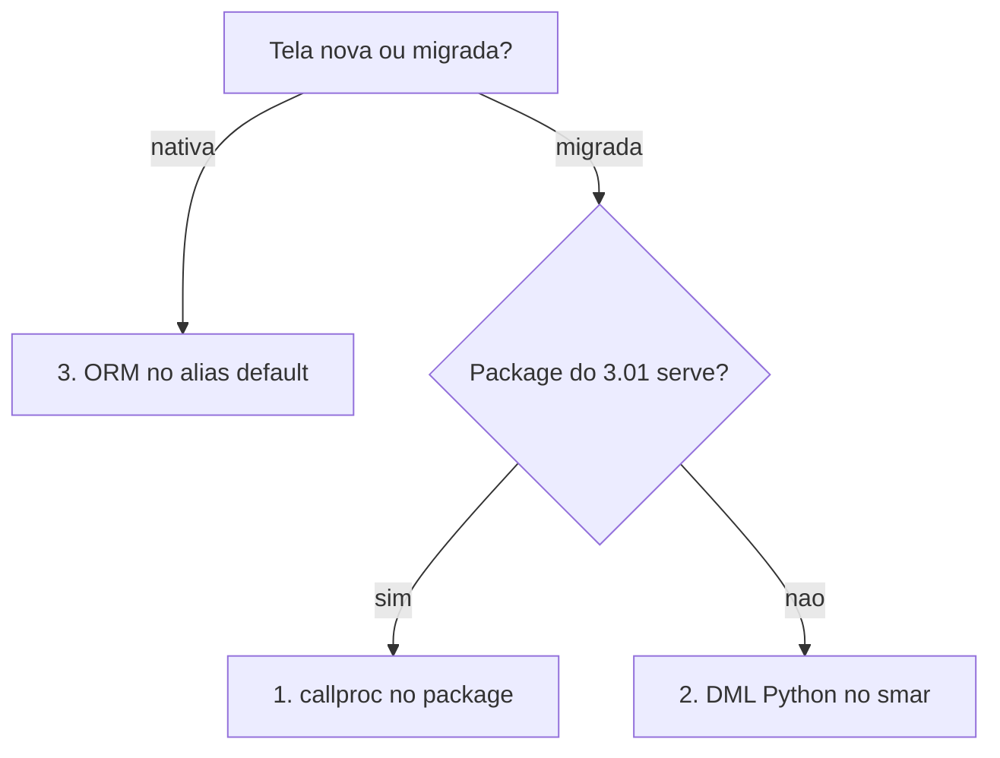

# Novas telas (legado vs nativo)

Como criar um cadastro ou módulo neste repositório. O contrato de UX/API continua em [`padrao-cadastro-listagem.md`](./padrao-cadastro-listagem.md). Este arquivo decide **origem e persistência**.

Produção atual: **Smarnet 3.01 (PHP)** no mesmo Oracle. O **Smarnet Novo** ainda não substitui o 3.01 por completo, mas já é o ambiente de **aplicações novas** e, aos poucos, de **telas migradas**. No go-live de cada módulo, a tela PHP equivalente é desativada ([ADR 0006](../adr/0006-desativacao-legado-por-modulo.md)).

Antes de implementar: [`CONTEXT.md`](../../CONTEXT.md), [`ARCHITECTURE.md`](../../ARCHITECTURE.md), [`OPENSPEC.md`](../../OPENSPEC.md). Playbook de migração (identidade `USER` → `PCK_DQANET`, backend/frontend): [`refatoracao-smarnet-novo.md`](./refatoracao-smarnet-novo.md).

## Dois modos

| Modo | Quando | Persistência |
|------|--------|----------------|
| **Tela migrada** | Fluxo que já existe no 3.01 (package/tabela Oracle) | `callproc` no package do 3.01, ou DML Python no `smar` quando o contrato não serve |
| **Aplicação nativa** | Módulo nascido neste Django, sem equivalente PHP | ORM Django e/ou tabela Oracle nova (DBA) |

O molde de tela (ViewToggle, perms, hexágono, paths EN) é o **mesmo**. Wrapping de package só no modo migrado.

Implementação de referência: `frontend/src/modules/purchasing/` + `backend/apps/purchasing/` (e `commercial` para cadastro migrado de Cliente).

## Qual módulo? (gate)

Toda tela, API, perm ou cadastro novo precisa de um **home** em `backend/apps/<modulo>/` + `frontend/src/modules/<modulo>/`. Pastas e prefixos de API são **inglês** (rotas [ADR 0003](../adr/0003-rotas-frontend-em-ingles.md)); termos de domínio permanecem em português.

Se o bounded context **não** estiver explícito no pedido, **parar e perguntar** — não inferir pelo menu do 3.01, pelo nome da tabela Oracle, nem pelo “lugar mais próximo”. Oferecer as opções do mapa (não lista aberta) e não criar pastas, rotas, `INSTALLED_APPS` nem perms até a resposta.

Perguntar quando qualquer um destes for verdadeiro:

- A feature cabe em mais de um contexto (ex. Cliente em Comercial vs cadastro mestre em Settings).
- O menu legado 3.01 diz “Administração” mas a rota Novo já é outra (caso Cliente).
- É componente compartilhado (`files`) usado por um host (Cliente, futuramente OP).
- Ainda não existe o app e a tentação é jogar em `pages/` ou em `users`.
- É “configuração” (`/settings/*`) — shell vs `users` vs `files` vs `administration`.
- Cruzar dois contextos: quem é dono do write?

| Contexto já fechado | Módulo |
|---------------------|--------|
| Cadastro / abas de Cliente | `commercial` |
| Fornecedor | `purchasing` |
| Dashboard/relatório do menu Administração | `administration` |
| Ordem de Produção | `production` |
| Notícia/grupo/menu público | `portal` |
| Árvore de arquivos / `PAR_SISTEMA` | `files` (o host só passa `sistema` + `filtro`) |
| Usuário, pessoa, empresa, grupo, solicitação de acesso | `users` (UI em `/settings`) |
| Token de filial | `branch_auth` |

**Não** criar `backend/apps/settings/` — `/settings` é shell React sobre `users` + `files`; o nome colide com `config/settings/`.

Se a resposta criar contexto novo: checklist em [`AI_DEVELOPMENT_RULES.md`](../../AI_DEVELOPMENT_RULES.md) e termo em [`CONTEXT.md`](../../CONTEXT.md).

## Três vias de escrita

Decisão em [ADR 0005](../adr/0005-escrita-oracle-reuso-ou-python.md). Ordem de preferência:

1. **`callproc` no package do 3.01** — via padrão da tela migrada. Vale mesmo com `COMMIT` interno, desde que a tela seja **um** save e a procedure propague erro. Ex.: `PCK_CLIENTE.*`, `SP_IN_PRE_PESSOA`, `SP_IN_EMPRESA`, `PCK_DQANET.SP_UP_USUARIOS`.
2. **DML Python no repositório** (alias `smar`, dentro de `atomic()`) — só quando o objeto do 3.01 engole erro em `WHEN OTHERS`, faz `ROLLBACK` da sessão, grava senha em texto puro, dispara e-mail, ou o caso de uso precisa compor com o banco `default`. Hoje só `SP_IN_USUARIO` cai aqui. **Não** criar `PCK_*` cosmético como alternativa.
3. **ORM no `default`** — aplicação nativa.

Reuso limpo (sem `COMMIT`, erro sobe): `PCK_USUARIO.SP_IN_PESSOA`, `PCK_DQANET.SP_IN_PESSOA`, `SIAOS.SP_IN_PESSOA`, `PCK_USUARIO.SP_UP_EMPRESA`.

Ao replicar em Python, herdar a regra do legado **sem** herdar a corrida: `SELECT MAX(...) + 1` do 3.01 vira `select_for_update()`.

Schema Oracle próprio do Django (`SMARNETPY`) é promoção futura, não proibição — só se aparecer segundo escritor Oracle no mesmo write ou o DBA recusar DML da conta técnica.

## Comum aos dois modos

1. Termo canônico em [`CONTEXT.md`](../../CONTEXT.md) **antes** de codar.
2. Bounded context em `backend/apps/<contexto>/` (`domain/`, `application/`, `infrastructure/`, `presentation/`, `tests/`). App label de perms: `<contexto>_infrastructure`.
3. API + UI copiando Compras: paths EN ([`app-routes.md`](./app-routes.md)), i18n pt-BR/en/es, `hasPermission` único em `frontend/src/lib/userPermissions.ts`. UI com o Design System ([`design-system.md`](./design-system.md)).
4. Perms Django `view_` / `add_` / `change_` / `delete_`. ACE hardcoded no PHP (tipo A) vira extra perm com nome amigável; ACE na coluna da linha (tipo B) fica para `ACESSO_FUNC` — [ADR 0007](../adr/0007-ace-codigo-django-vs-acesso-func.md).
5. Guia em `docs/operators/` no mesmo PR da tela.
6. Sem lógica de negócio em view, serializer ou model ORM.
7. Caso de uso que escreve nos **dois** bancos: `atomic(using="smar")` é o bloco **externo**, para commitar por último. Não há transação única entre `default` e `smar`; a ordem de commit escolhe qual órfão é possível, e o resíduo aceitável é o que mantém a operação repetível. Some com compensação por `delete()` — a recuperação é repetir, então o caso de uso precisa de guarda de idempotência. Referência: aprovação de pré-pessoa em `ApproveAccessRequestUseCase`.

## Modo A — tela migrada (legado 3.01)

1. Copiar DDL para `docs/_scripts/tables/` e o **package** para `docs/_scripts/packages/`. Modelo: [`PCK_CLIENTE.pck`](../_scripts/packages/PCK_CLIENTE.pck) + [`siaos.cliente.sql`](../_scripts/tables/siaos.cliente.sql). Anotar procedures de grava (`SP_*`) vs functions de consulta (`SF_*`) vs triggers.
2. Writes via procedure do package (`callproc`) no repositório — ver `backend/apps/purchasing/infrastructure/repositories/oracle_recebimento_repository_impl.py`. Lists/gets via SQL no query repository. Models Django **unmanaged**.
3. Reescrever o package em Python só na exceção da via 2 acima, e com o motivo citado no repositório. Não é licença para replicar package que serve. Domain services só para o que o PHP fazia na aplicação e o Oracle não garante (ownership, filtros de UI, perms, `CLIENT_IDENTIFIER`).
4. Grants da conta técnica `smar` em `docs/admins/` se faltar `EXECUTE`/`SELECT` (modelo: [`grants-oracle-clientes.md`](../admins/grants-oracle-clientes.md)).
5. **Contrato de produção:** não alterar assinatura nem comportamento de package/tabela que o PHP 3.01 usa. Arquivos em `docs/_scripts/` são **cópia de leitura**, não fonte de deploy no banco.

## Go-live — desativação do legado

Decisão em [ADR 0006](../adr/0006-desativacao-legado-por-modulo.md).

Quando o equivalente neste Django entra em produção, a tela/fluxo PHP correspondente **sai**. Não manter as duas UIs após o go-live do módulo; não esperar desligar o 3.01 inteiro.

Primeira leva (`/settings`): cadastro de Pessoa, Empresa e Usuário. Usuário Django não tem tela 3.01 — o que se desliga é o cadastro PHP de Usuário. Demais módulos: a mesma regra, um a um.

O corte é da **UI PHP**. Package/tabela Oracle só deixa de ser contrato do 3.01 quando não houver outro escritor PHP (tela, job, Forms) naquele objeto.

Em conflito entre “jeito genérico Django” e o objeto Oracle do 3.01, **vence o legado + o padrão Smarnet** (ou abra um ADR).

## Modo B — aplicação nativa (não é legado)

1. Não exigir inventário de package. **Não** criar `PCK_*` cosmético.
2. Persistência:
   - Dado que precisa coexistir com o 3.01 → tabela/package Oracle com DBA (mesmo rigor de contrato do modo A).
   - Dado só deste ambiente (sessão Django, perms, tokens de device) → models Django gerenciados, como `users` / `branch_auth`.
3. Regras de negócio em use cases e, se couber, domain services (não há package para “respeitar”).
4. Continua proibido: lógica na view/serializer; furar hexágono.

## Checklist do agente

- [ ] Decidi modo A (migrada) ou B (nativa) e registrei o termo no glossário
- [ ] Li o padrão de cadastro/listagem: casca da listagem = Clientes; API/perms = Compras (não inventei UX)
- [ ] UI com o Design System (`docs/developers/design-system.md`) — `@/components/ui`, sem clone no módulo
- [ ] Camadas hexagonais + perms + i18n + rota EN + guia de operador
- [ ] Se modo A: scripts em `docs/_scripts/`, `callproc`, unmanaged, sem ALTER no objeto do 3.01
- [ ] Se modo A e caí na via 2 (DML Python): motivo do contrato quebrado citado no repositório, sem `PCK_*` cosmético, `select_for_update()` onde o legado fazia `MAX + 1`
- [ ] Se escrevo nos dois bancos: `atomic(using="smar")` externo e guarda de idempotência
- [ ] Se modo B: sem `PCK_*` fictício; persistência justificada
- [ ] Go-live do módulo: tela PHP equivalente sai (não projetar as duas UIs após o corte)
