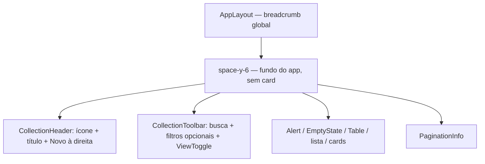

# Padrão de cadastro e listagem (ERP)

**Este é o padrão obrigatório** para novas entidades de cadastro no Smarnet (listagem + detalhe + API + permissões).

Agentes de IA e desenvolvedores devem **seguir este documento** ao criar ou estender cadastros. Em dúvida:

- **Casca da listagem (página inteira)** — copie **Clientes** (`/app/commercial/customers`, `frontend/src/modules/commercial/pages/ClientesPage.tsx`). Demo: `/design-system/components/collection`.
- **API, permissões, três modos, row actions** — copie **Compras** (`frontend/src/modules/purchasing/` + `backend/apps/purchasing/`) e adapte nomes.

Não invente outro layout de listagem nem outro modelo de permissão. Confirme o módulo em [`novas-telas.md`](./novas-telas.md) antes de criar pastas.

Pré-requisitos: [`ARCHITECTURE.md`](../../ARCHITECTURE.md), [`novas-telas.md`](./novas-telas.md) (migrada vs nativa), [`AI_DEVELOPMENT_RULES.md`](../../AI_DEVELOPMENT_RULES.md), [`OPENSPEC.md`](../../OPENSPEC.md), [`design-system.md`](./design-system.md) (componentes/tokens), Design System → Collection / Table / Patterns.

---

## 1. Quando usar

Use este padrão quando a feature for:

- Cadastro mestre (CRUD ou CRU + inativação)
- Listagem paginada com busca/filtros
- Detalhe do registro
- Controle por permissões Django (`view` / `add` / `change` / `delete`)

Não use para: dashboards, wizards longos, file managers ou telas só de configuração mock.

---

## 2. Decisões já tomadas (não reabrir sem ADR)

| Tema | Decisão |
|------|--------|
| Visualizações da listagem | Sempre **Tabela**, **Lista** e **Cards** via `ViewToggle` + `useViewMode` (localStorage) |
| Ações na linha | Visualizar / Editar / Excluir (ou Inativar), filtradas por permissão |
| Tabela / Lista | Menu ⋮ **à esquerda** (coluna sem texto de header) |
| Cards | **Sem** avatar/badge de código truncado; mesmas ações como **botões no rodapé** |
| Exclusão de mestre Oracle com flag ativo | Preferir **inativar** (soft), não hard delete, quando o domínio já usa `ativo` / procedures |
| Breadcrumb | Declarar via `usePageBreadcrumb` — a barra fica no `AppLayout`, não na página |
| API | Camadas hexagonais; lógica em use cases; views finas |
| Auth API | Sessão Oracle + permissões Django no payload do usuário |
| UI i18n | Chaves em `pt-BR` / `en` / `es` |

---

## 3. Backend — estrutura

Dentro de `backend/apps/<contexto>/`:

```text
domain/          # entidades, ports de repositório, exceções
application/     # use cases, DTOs, mappers
infrastructure/  # models (Oracle unmanaged se for o caso), repos, migrations de permissões
presentation/    # views DRF, serializers, urls, permissions helpers
tests/
```

### 3.1 Use cases típicos

Para um recurso `Recurso`:

- `ListRecursos` — paginação + `search` + filtros (ex. ativo)
- `GetRecurso`
- `GravaRecurso` (create) / `AtualizaRecurso` (update) — ou um use case com modo create/update se o legado assim exigir
- `AtivaRecurso` / `InativaRecurso` — se houver soft status
- Filhos (contatos, itens): list/grava/exclui conforme o domínio

### 3.2 API REST (convenção)

Montar sob `/api/<contexto>/`:

| Método | Rota | Permissão típica |
|--------|------|------------------|
| `GET` | `/recursos/` | `view_*` |
| `POST` | `/recursos/` | `add_*` |
| `GET` | `/recursos/<id>/` | `view_*` |
| `PUT` | `/recursos/<id>/` | `change_*` |
| `POST` | `/recursos/<id>/ativar/` | `change_*` |
| `POST` | `/recursos/<id>/inativar/` | `change_*` |

Query de listagem (referência): `search`, `ativo` (opcional), `page`, `page_size`.

Resposta de lista: incluir `items` (ou equivalente), `total`, `page`, `page_size` para a UI paginar.

Registrar urls em `backend/config/urls.py` e documentar no OpenAPI (drf-spectacular).

### 3.3 Permissões

1. Modelos (mesmo unmanaged) devem gerar codenames Django padrão: `view_`, `add_`, `change_`, `delete_`.
2. App label estável (ex. `<contexto>_infrastructure`).
3. Helpers em `presentation/permissions.py` escolhem a lista de perms por método HTTP (GET vs POST vs PUT).
4. Views exigem autenticação de sessão + as perms do helper.
5. **Inativar/ativar** costuma exigir `change_*` (não `delete_*`), alinhado ao soft delete.
6. Espelhar as strings no frontend (`app_label.codename`) e checar com `hasPermission` em `frontend/src/lib/userPermissions.ts` (módulos só exportam constantes de perm); **superuser** passa em todas.
7. **ACE no código da tela** (número do 3.01 em `SF_VALIDA_ACESSO`) vira extra perm Django com nome amigável. **ACE na coluna da linha** usa `ACESSO_FUNC` + chapa — ver [acesso-atividade.md](./acesso-atividade.md) e [ADR 0007](../adr/0007-ace-codigo-django-vs-acesso-func.md). Não copiar o número ACE (ex. 370) para o código da aplicação.

Não inventar um sistema de roles paralelo para cadastros mestres.

---

## 4. Frontend — estrutura do módulo

```text
frontend/src/modules/<contexto>/
  api/           # client HTTP tipado
  components/    # form dialog, row actions, etc.
  hooks/         # react-query + useXxxAccess
  pages/         # ListPage, DetailPage, Route guard
  types/
  permissions.ts # constantes PURCHASING_PERMS-like
  index.ts
```

### 4.1 Rotas (`App.tsx`)

- **Paths em inglês** (kebab-case); labels/menus em português — ver [ADR 0003](../adr/0003-rotas-frontend-em-ingles.md), [app-routes.md](./app-routes.md) e `AGENTS.md`
- Índice do módulo: `ModuleIndexPage` + entrada em `erpNavigation.ts`
- Listagem: `/app/<module>/<resource>`; detalhe: `/app/<module>/<resource>/:id`
- Guard de rota: se não tiver `view_*`, redirecionar (padrão do route component de Compras)
- Path legado substituído → `<Navigate replace />` para o path canônico
- **Obrigatório** EN em rotas novas e existentes; tabela canônica `/app/*` em [app-routes.md](./app-routes.md)

### 4.2 Navegação

Em `frontend/src/config/erpNavigation.ts`: item com `path`, `permission` (view) e/ou `managerOnly` quando aplicável. O menu só mostra o que o usuário pode ver.

### 4.3 Breadcrumb

Na página:

```ts
usePageBreadcrumb([
  { label: t('nav.<modulo>'), href: '/app/<module-en>' },
  { label: t('<contexto>.<recurso>.title') }, // página atual sem href
]);
```

Não renderizar `<nav>` de breadcrumb local — a faixa é global no layout.

---

## 5. Tela de listagem (obrigatório)

A unidade do padrão é a **página inteira**, não só a tabela. Referência viva: Clientes (`/app/commercial/customers`).



```
<div className="space-y-6">
  <CollectionHeader />  {/* ícone + título + **Novo** à direita */}
  <CollectionToolbar />  {/* busca + filtros opcionais + ViewToggle */}
  Alert | EmptyState | Table | lista | cards
  <PaginationInfo />
</div>
```

**Proibido na listagem**

- Card de página: `rounded-2xl border border-border/50 bg-card p-6 shadow-sm` (e equivalentes) em volta de título, busca ou tabela.
- Segundo wrapper de borda em volta do `<Table>` — o componente já traz `rounded-xl border bg-background`, thead muted e zebra.
- Reestilizar `thead` / linhas no módulo (sem `bg-blue-500`, hex, ou zebra local).

O fundo da listagem é o do app. Só o `Table` e os itens dos modos lista/cards têm borda própria.

Telas já alinhadas: Clientes, Fornecedores (`/app/purchasing/suppliers`), Devices (`/app/devices`), OPs (`/app/production/orders`). Detalhe de cadastro, home e perfil podem continuar com card — não são listagem.

### 5.1 Cabeçalho e toolbar

**Cabeçalho** (`CollectionHeader`): ícone + h1 + subtítulo; **Novo Xxx** à direita se `add_*`.

**Toolbar** (`CollectionToolbar`), da esquerda para a direita:

1. Busca (`SearchField`)
2. Filtros (`Select` / dropdown) — slot opcional. **Clientes não tem filtro.**
3. **`ViewToggle`** à direita

O botão **Novo** não fica na toolbar. Em listagens filhas (contatos, etc.) o `actions` da toolbar ainda pode receber um botão de inclusão.

Chave de persistência: `smarnet:view:<contexto>-<recurso>` via `useViewMode`.

Componentes: `@/components/ui/collection-header`, `@/components/ui/collection-toolbar`, `@/components/ui/forms` (`SearchField`), `@/components/ui/ViewToggle`, `@/hooks/useViewMode`.

### 5.2 Três modos

| Modo | Layout | Ações |
|------|--------|--------|
| `tabela` | `<Table>` do DS (borda, fundo claro, thead muted, zebra — **não** envolva com outro card). Referência: Clientes. | Coluna estreita **à esquerda**, header vazio; menu ⋮ |
| `lista` | Linhas tipo row card | Menu ⋮ à esquerda |
| `cards` | Grid responsivo | Botões no **rodapé** do card (`variant="buttons"`) |

Regras de card:

- Título + identificador (código completo em mono), status
- Campos secundários em `<dl>` compacto
- **Não** usar badge quadrado com últimos dígitos do código
- Clique no card/linha abre detalhe; ações usam `stopPropagation`

### 5.3 Ações de linha

Componente dedicado (ex. `*RowActions`) com:

- Props: `canView`, `canEdit`, `canDelete`, callbacks, `variant: 'menu' | 'buttons'`
- Menu: `ActionsDropdown` + ícone `MoreVertical`
- Botões: `Button` `outline` / `destructive`, size `sm`, com ícone + label i18n (`module.view` / `module.edit` / `module.delete`)
- Só renderizar ações permitidas; se nenhuma, não mostrar coluna/rodapé

**Excluir na UI** (quando soft):

- Mostrar só se registro ativo e (`delete_*` **ou** `change_*`), conforme a regra do domínio de referência
- Confirmar com `window.confirm` (ou dialog) + mensagem i18n
- Chamar endpoint de **inativar**, não DELETE do mestre

### 5.4 Paginação

Rodapé: `@/components/ui/pagination-blocks` (`PaginationInfo`) com labels i18n (`recordLabel`, `showingLabel`, `ofLabel`, `prevLabel`, `nextLabel`). `page_size` alinhado à API (referência: 20).

### 5.5 Estados

- Loading: spinner centrado
- Erro de carga / ação: `Alert`
- Lista vazia: `EmptyState`; loading: `EmptyState variant="loading"`

### 5.6 Criar / editar na listagem

- **Novo** e **Editar** abrem dialog de formulário (`*FormDialog`)
- Após criar com sucesso, navegar para o **detalhe** do novo id
- Editar pode permanecer na lista ou ir ao detalhe — referência: dialog na lista + detalhe com edição própria
- **Exceção (Clientes):** o formulário de Dados Gerais é grande demais para modal; **Editar** abre `/app/commercial/customers/:codCliente/edit`. **Novo** continua em dialog (wizard CNPJ/CPF).

---

## 6. Tela de detalhe

- Breadcrumb: Módulo → Listagem (href) → identificador/nome atual
- Ações: Editar, Ativar/Inativar (se `change_*`)
- Seções filhas (ex. contatos) com CRUD próprio e perms `*_filho`
- Volta à listagem via breadcrumb ou botão explícito se necessário

### 6.1 Visualizar vs editar (ficha com abas)

Referência: Cliente — `/app/commercial/customers/:codCliente` (visualizar) e `.../:codCliente/edit` (editar).

- **Visualizar:** todas as abas (não só a primeira) com campos `readOnly`/`disabled` e sem botões de gravar/adicionar. Permissão `change` **não** habilita campos até entrar em `/edit`.
- **Editar:** habilita conforme perm de cada aba (`change_cliente`, `change_clientecobranca`, etc.).
- Abas tipo pasta: `Tabs variant="folder"`. Cabeçalho e painel da aba ativa = `bg-card`; faixa das abas transparente; inativas mais escuras.

### 6.2 Preencher o `main` (`fill`, opt-in)

Fichas longas (Cliente) podem usar `<Tabs variant="folder" fill>` para o cartão da aba ocupar a **área restante** do `main` **a partir de `lg`**. Página: `flex flex-col lg:min-h-0 lg:flex-1`; header da ficha `shrink-0`. Abaixo de `lg`: faixa numa linha (swipe), sticky; a ficha cresce e o `main` rola. Sem `fill`, a altura segue o conteúdo em qualquer viewport. Ver [design-system.md](./design-system.md) §4.2.

---

## 7. Cliente API e hooks

- Funções tipadas em `api/` (erros via classe `ApiError` ou equivalente do módulo)
- React Query: `useQuery` para list/get; `useMutation` para grava/atualiza/inativa com invalidação da listagem
- Hook `useXxxAccess` encapsula `hasPermission` para a página não espalhar strings de perm

---

## 8. i18n

- Chaves por módulo: título, colunas, status, confirmações, erros
- Ações genéricas de linha: `module.view`, `module.edit`, `module.delete`, `module.actions`
- View toggle: `view.tabela`, `view.lista`, `view.cards`
- Atualizar **pt-BR**, **en** e **es**

---

## 9. Checklist do agente (copiar e cumprir)

Antes de implementar um cadastro novo:

- [ ] Li este padrão + ARCHITECTURE + OPENSPEC
- [ ] Defini perms `view/add/change/delete` e strings no front
- [ ] Use cases + repos nas camadas corretas (sem lógica de negócio na view/serializer)
- [ ] Rotas API no formato da §3.2 (+ ativar/inativar se soft)
- [ ] Módulo front com api, hooks, pages, permissions
- [ ] Entrada em `erpNavigation` + rotas em `App.tsx` + guard `view`
- [ ] Listagem = página inteira como Clientes (`CollectionHeader` + toolbar; **sem** card `bg-card` envolvendo a página)
- [ ] **Novo** no `CollectionHeader` (direita); filtros opcionais na `CollectionToolbar` (Clientes não tem filtro)
- [ ] `Table` do DS sem wrapper extra de borda; thead/zebra não reestilizados no módulo
- [ ] Toolbar, `ViewToggle`, 3 modos, ações left/menu vs footer/buttons
- [ ] Cards sem avatar de código truncado
- [ ] Soft inativar se o domínio usa flag ativo
- [ ] `usePageBreadcrumb` (sem nav local)
- [ ] i18n nos 3 idiomas
- [ ] UI com componentes do Design System (`FormSection`, `FormGrid`, `FormInput`/`FormCombobox`, `CollectionHeader`, `CollectionToolbar`, `SearchField`, `EmptyState`, `PaginationInfo`, `ViewToggle`, `StatusBadge`…) — ver [design-system.md](./design-system.md)
- [ ] Detalhe com abas: visualizar trava **todas** as abas; `folder` + `fill` só se a ficha deve ocupar o `main` (como Cliente) e só ≥ `lg` (no estreito swipe + scroll no `main`)
- [ ] Testes de API/perms no backend (e smoke de UI se houver harness)

**Não fazer:**

- Só tabela sem lista/cards
- Envolver a listagem em card de página (`rounded-2xl … bg-card p-6`)
- Colocar o **Novo** da página na `CollectionToolbar` — o botão vai no `CollectionHeader`
- Reestilizar thead/zebra ou duplicar a borda do `Table`
- Menu de ações só à direita “porque é comum em outros sistemas”
- Hard delete de mestre Oracle quando o padrão do contexto é inativar
- Embutir breadcrumb no `max-w` da página
- Bypass de permissão só no front (API deve validar)
- Inventar `Section`/`h3` ou `Label`+`Input` crus no módulo quando `@/components/ui/forms` já cobre
- Envolver o `Outlet` em wrapper que clipa todas as páginas (`flex-1 min-h-0`) — listagens precisam crescer e rolar no `main`
- Ligar `fill` em todo `Tabs folder` (só fichas que devem ocupar o `main`; não no preview padrão do DS nem no FileManager)
- Na ficha, usar `min-h-0 flex-1` em viewport estreita — abaixo de `lg` a página deve crescer e o `main` rolar

---

## 10. Referência no código

| Camada | Onde olhar |
|--------|------------|
| Casca da listagem (página inteira) | `frontend/src/modules/commercial/pages/ClientesPage.tsx` — `/app/commercial/customers` |
| Listagem + 3 views + ações | `frontend/src/modules/purchasing/pages/FornecedoresPage.tsx` (mesma casca de Clientes) |
| Row actions menu/buttons | `frontend/src/modules/purchasing/components/FornecedorRowActions.tsx` |
| Perms front | `frontend/src/modules/purchasing/permissions.ts` |
| ViewToggle | `frontend/src/components/ui/ViewToggle.tsx`, `hooks/useViewMode.ts` |
| Listagem (header/toolbar/empty/pager) | `CollectionHeader`, `CollectionToolbar`, `SearchField`, `EmptyState`, `PaginationInfo` — demo `/design-system/components/collection` |
| Demo Design System | `/design-system/components/collection` (exemplo Clientes), `/design-system/components/table`, `/design-system/patterns`, `/design-system/components/form`, `/design-system/components/tabs` (`folder` + `fill`) |
| Ficha (visualizar/editar + fill) | `frontend/src/modules/commercial/pages/ClienteDetailPage.tsx` — [design-system.md](./design-system.md) §4.1–4.2 · demo `/design-system/patterns` |
| Formulários / seções | `@/components/ui/forms` (`FormSection`, `FormGrid`, `FormInput`, `FormCombobox`) — [design-system.md](./design-system.md) |
| API + perms back | `backend/apps/purchasing/presentation/` |
| Use cases | `backend/apps/purchasing/application/use_cases/` |

Ao gerar código novo, **renomeie** entidades e paths; preserve o comportamento descrito acima.
