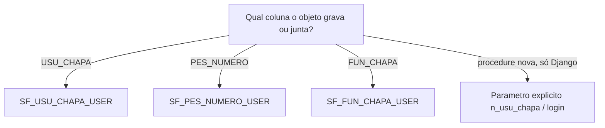

# Refatoração Smarnet 3.01 → Smarnet Novo

Playbook para migrar uma tela ou um objeto Oracle do **Smarnet 3.01 (PHP)** para o **Smarnet Novo** (Python/Django + React), no **mesmo Oracle**. O número de versão de produção do Novo (4, 27, …) ainda não foi decidido — ver [`CONTEXT.md`](../../CONTEXT.md).

Não substitui as decisões já registradas. Leia junto:

| Tema | Fonte |
|------|--------|
| Tela migrada vs nativa; vias de escrita | [`novas-telas.md`](./novas-telas.md), [ADR 0005](../adr/0005-escrita-oracle-reuso-ou-python.md) |
| Identidade na sessão Oracle | [ADR 0004](../adr/0004-oracle-client-identifier.md) |
| UX/API/perms de cadastro | [`padrao-cadastro-listagem.md`](./padrao-cadastro-listagem.md) |
| Paths EN | [`app-routes.md`](./app-routes.md), [ADR 0003](../adr/0003-rotas-frontend-em-ingles.md) |
| Corte do PHP no go-live | [ADR 0006](../adr/0006-desativacao-legado-por-modulo.md) |
| Glossário | [`CONTEXT.md`](../../CONTEXT.md) |

Caso de estudo (Clientes): [`administracao-clientes.md`](./administracao-clientes.md).

---

## 1. O que muda na sessão

| | Smarnet 3.01 (PHP) | Smarnet Novo |
|--|-------------------|--------------|
| Login Oracle | Usuário final (muitas vezes senha genérica). `USER` **é** o operador. | Conta técnica `API_SMAR` (alias Django `smar`). `USER` **é** `API_SMAR`. |
| Quem é o operador | `USER` / `SESSION_USER` | `CLIENT_IDENTIFIER` = login web (`USU_LOGINWEB`), definido por requisição e limpo no fim |
| Autorização de tela | `SMARNET.ACESSO` / `SF_VALIDA_ACESSO` (chapa de **funcionário**) | Permissões Django (`view_` / `add_` / `change_` / `delete_`). `CLIENT_IDENTIFIER` **não** autoriza. |

O middleware (`oracle_session_context.py`) carimba o identifier. PL/SQL legado que ainda faz `WHERE USU_LOGINWEB = USER` **não vê o operador** e quebra (`NO_DATA_FOUND`, chapa `7`, e-mail de erro que não chega a ninguém).

Não inventar `SIAOS.PCK_SMARNET`. As functions de identidade da sessão estão em **`SIAOS.PCK_DQANET`**.

Cópia de leitura: [`PCK_DQANET.pck`](../_scripts/packages/PCK_DQANET.pck). Arquivos em `docs/_scripts/` **não** são deploy automático. Compilar no banco é trabalho de DBA/`SIAOS` (`API_SMAR` toma `ORA-01031`).

---

## 2. Identidade no PL/SQL: não usar `USER` direto

### 2.1 Sintoma clássico

Trigger ou package faz:

```sql
SELECT USU_CHAPA INTO n_usu_chapa
  FROM SIAOS.USUARIO
 WHERE USU_LOGINWEB = USER;
```

No PHP isso funciona. Com `API_SMAR` não há linha → `ORA-01403` (ex.: `TG_B_IU_EMBARQUE` ao gravar cliente, porque o insert dispara embarque/cobrança e o log precisa da chapa).

O mesmo padrão aparece em e-mail de `WHEN OTHERS` (`WHERE UPPER(USU_LOGINWEB) = USER`) — o erro some no vácuo. Ver [ADR 0005](../adr/0005-escrita-oracle-reuso-ou-python.md).

### 2.2 Login da sessão (um lugar só)

`PCK_DQANET.SF_LOGIN_SESSAO` (privada):

```sql
UPPER(TRIM(NVL(SYS_CONTEXT('USERENV','CLIENT_IDENTIFIER'), USER)))
```

- Smarnet Novo: lê o identifier.
- PHP 3.01 e jobs sem identifier: cai no `USER` (comportamento antigo preservado).

Toda resolução de operador no PL/SQL deve partir **dessa** ideia (via as `SF_*` abaixo), nunca de `USER` cru.

### 2.3 Qual function usar

São **três identidades diferentes**. Escolher pela **coluna que o objeto grava ou junta**, não pelo nome “chapa” no comentário do PHP.

| Precisa de | Function | Origem | Quando |
|------------|----------|--------|--------|
| **`USU_CHAPA`** (PK de `SIAOS.USUARIO`) | `SIAOS.PCK_DQANET.SF_USU_CHAPA_USER` | `USUARIO.USU_CHAPA` via `USU_LOGINWEB` / `USU_LOGIN` | Log (`LOG_CLIENTE.USU_CHAPA`), auditoria de cadastro, “quem alterou” no sentido **usuário do sistema** |
| **`PES_NUMERO`** (pessoa) | `SIAOS.PCK_DQANET.SF_PES_NUMERO_USER` | `USUARIO.PES_NUMERO` | FK para pessoa, integração que fala em pessoa, não em login |
| **`FUN_CHAPA`** (PK de `SIAOS.FUNCIONARIO`) | `SIAOS.PCK_DQANET.SF_FUN_CHAPA_USER` | `FUNCIONARIO` ativo da pessoa da sessão | RH, `SMARNET.ACESSO_FUNC`, legado `SF_VALIDA_ACESSO` |

Árvore rápida:



1. A coluna / o log é `USU_CHAPA`? → **`SF_USU_CHAPA_USER`**. Não use `SF_PES_NUMERO_USER` nem `SF_FUN_CHAPA_USER`.
2. A coluna é `PES_NUMERO`? → **`SF_PES_NUMERO_USER`**.
3. A coluna é `FUN_CHAPA` (funcionário RH)? → **`SF_FUN_CHAPA_USER`**.
4. Procedure **nova** (só o Django chama): preferir parâmetro explícito `n_usu_chapa` / login ([ADR 0004](../adr/0004-oracle-client-identifier.md) §3). As `SF_*` existem para **não alterar a assinatura** do que o PHP ainda chama.

Exemplo certo (embarque/cobrança):

```sql
n_usu_chapa := SIAOS.PCK_DQANET.SF_USU_CHAPA_USER;
```

Referência aplicada: [`TG_B_IU_EMBARQUE.trg`](../_scripts/triggers/TG_B_IU_EMBARQUE.trg), [`TG_B_IU_COBRANCA.trg`](../_scripts/triggers/TG_B_IU_COBRANCA.trg), [`TG_B_IU_CLIENTE.trg`](../_scripts/triggers/TG_B_IU_CLIENTE.trg).

### 2.4 Fallbacks (não tratar como “o operador”)

`SF_USU_CHAPA_USER`, se não achar login:

- `USER IN ('GERAL','SIAOS')` → chapa `2623` (legado de job/schema).
- Identifier **preenchido** e sem match → **`NULL`** (não inventar operador).
- Sem identifier (PHP antigo) → chapa `7`.
- `USER = 'API_SMAR'` e sem identifier → **`NULL`** (não usar a chapa `7` do PHP).

Com `API_SMAR` + identifier certo, o resultado tem de ser a chapa do operador — **nunca** `7`. Conferir como DBA:

```sql
BEGIN
  DBMS_SESSION.SET_IDENTIFIER('loginweb_do_operador');
END;
/

SELECT SYS_CONTEXT('USERENV','SESSION_USER') AS sess,
       SYS_CONTEXT('USERENV','CLIENT_IDENTIFIER') AS ident,
       SIAOS.PCK_DQANET.SF_PES_NUMERO_USER AS pes,
       SIAOS.PCK_DQANET.SF_USU_CHAPA_USER AS chapa,
       SIAOS.PCK_DQANET.SF_FUN_CHAPA_USER AS fun_chapa
  FROM DUAL;
```

`sess` continua `API_SMAR`. Probe no repo: `backend/scripts/verify_pck_dqanet_identity.py`.

### 2.5 Checklist PL/SQL ao tocar um objeto do 3.01

No spec/body, trigger e views:

- [ ] `USER`, `SESSION_USER`, `CURRENT_USER` usados para **saber quem é o operador** (não para grant/`USER_USERS`)
- [ ] `WHERE … = USER` em `USU_LOGINWEB` / `USU_LOGIN` / e-mail
- [ ] `SELECT … INTO` de chapa/pessoa sem `NO_DATA_FOUND` tratado (vira `ORA-01403` no insert)
- [ ] Comentário “chapa” no PHP: confirmar se é `USU_CHAPA`, `FUN_CHAPA` ou `PES_NUMERO`
- [ ] `END <nome>` da trigger bate com o nome do objeto (erro fácil ao copiar trigger)
- [ ] Compilar **nessa ordem** se mexer nas functions: `PCK_DQANET` → triggers que as chamam
- [ ] PHP 3.01 ainda chama o mesmo objeto: **não mudar assinatura**. Só o lookup de identidade.

`EMP_CODIGO` via `SGC.PCK_WINSGC.SF_EMP_CODIGO` na trigger de `CLIENTE` ainda pode divergir com conta técnica. Até adaptar, a aplicação corrige com `UPDATE` pós-insert ([ADR 0004](../adr/0004-oracle-client-identifier.md)). Não confundir isso com chapa.

No **Python**, o ator da tela (chapa + empresa dona) vem de `USER_SECURITY_PROFILE` + `SIAOS.USUARIO` (`resolve_actor_context`). Não inferir empresa do client payload.

---

## 3. Backend (Python)

### 3.1 Modo e escrita

Seguir [`novas-telas.md`](./novas-telas.md). Resumo:

1. Tela migrada e o package serve → `callproc` no repositório (alias `smar`).
2. Package engole erro / `COMMIT`+`ROLLBACK` / senha em claro → DML Python, motivo citado no repositório. Sem `PCK_*` cosmético.
3. Aplicação nativa → ORM no `default`.

Hexágono: view/serializer sem regra de negócio. Models Oracle **unmanaged**.

### 3.2 `callproc`: o contrato é o Oracle, não o PHP

O PHP 5.2 costuma bindar com prefixos (`c_tipo_msg`, `vc2_cliente`). O package real pode ter **outros nomes e outra ordem**. `PLS-00306` = assinatura errada.

- Conferir spec no banco ou na cópia em `docs/_scripts/packages/`.
- Contar argumentos (IN/OUT). Ex.: `SP_ATUALIZA_DADOS_GERAIS` tem dezenas de parâmetros; o form v1 não manda todos — **relê-los no UPDATE** em vez de zerar.
- Não inventar `OUT` que o package não tem.

Grants: package `DEFINER` (SIAOS) pode gravar tabelas que `API_SMAR` não tem `INSERT` direto. `SELECT` da API/Python na mesma tabela **ainda precisa de grant**. Inventário no módulo: modelo [`grants-oracle-clientes.md`](../admins/grants-oracle-clientes.md).

Erro Oracle de infraestrutura/package → resposta de API explícita (ex. **502**), sem contornar com DML paralelo de escrita.

### 3.3 Outros padrões que já apareceram

| Situação | O que fazer |
|----------|-------------|
| Lookup em schema de outro sistema (`PROTPROD.SRA010`, etc.) | Grant `SELECT` a `API_SMAR`; a procedure de cópia (`SP_FUNC2CLIENTE`) é `EXECUTE` à parte |
| `SELECT MAX + 1` no PHP | No Python, `select_for_update()` |
| Write em `default` **e** `smar` | `atomic(using="smar")` **externo**; idempotência; ver aprovação de pré-pessoa |
| `COMMIT` interno no package | Aceitável na via 1 se a tela for **um** save e o erro subir |
| Paginação 12c | `OFFSET … FETCH NEXT`; não chamar function pesada de validação no `COUNT` da lista |
| Testes do repositório | Assinatura/`callproc` com cursor fake; não exigir Oracle na CI |

---

## 4. Frontend (React)

Molde: `frontend/src/modules/purchasing/` (e `administracao` para cadastro migrado). Padrão: [`padrao-cadastro-listagem.md`](./padrao-cadastro-listagem.md).

| 3.01 (PHP) | Smarnet Novo |
|-----------|----------------|
| Script por tela, HTML/JS misturado | Módulo + hooks + API tipada |
| Menu/path em português | **Path EN** kebab-case; **label PT** ([ADR 0003](../adr/0003-rotas-frontend-em-ingles.md)) |
| Acesso `SF_VALIDA_ACESSO` | `hasPermission` + `useXxxAccess` (codename Django). ACE no script PHP → extra Django; ACE na coluna → `ACESSO_FUNC` depois ([ADR 0007](../adr/0007-ace-codigo-django-vs-acesso-func.md)) |
| Um form enorme na mesma página PHP | Listagem (ViewToggle) + detalhe; **Novo** em dialog; **Editar** em dialog *ou* página se o form for grande demais |
| Strings no PHP | i18n `pt-BR` / `en` / `es` |
| Cores hex do Oracle (`CRS_CORES`) | Tokens do Design System (`StatusBadge`); não interpolar hex legado |

Lições já aplicadas:

- Wizard (CNPJ/CPF/tipo) cabe em **modal**; Dados Gerais de Cliente **não** — edição em `/customers/:codCliente/edit`. Ver exceção no padrão de cadastro §5.6.
- Depois de criar, ir ao **detalhe**.
- Perms: `view` / `add` / `change` no frontend espelham o app label `<contexto>_infrastructure`.
- Rota nova: `App.tsx` + `erpNavigation` + redirect do path PT se existia.
- Mesmo PR: guia em `docs/operators/`.

Não copiar cegamente o modal de Fornecedor para um cadastro com wizard + dezenas de campos.

---

## 5. Documentação e deploy Oracle

1. Termo novo → [`CONTEXT.md`](../../CONTEXT.md) (glossário só).
2. DDL/package/trigger do 3.01 → `docs/_scripts/` (leitura). **Não** tratar como fonte de deploy.
3. Grants da conta técnica → `docs/admins/`.
4. Decisão difícil de reverter → ADR.
5. Compilar no banco na ordem de dependência; validar identifier **no Oracle live** (o arquivo no git pode estar na frente do que está compilado).

No go-live do módulo, a UI PHP sai ([ADR 0006](../adr/0006-desativacao-legado-por-modulo.md)). Package/tabela só muda de contrato quando não houver outro escritor 3.01.

---

## 6. Anti-padrões

| Evitar | Preferir |
|--------|----------|
| `WHERE USU_LOGINWEB = USER` | `SF_USU_CHAPA_USER` / `SF_PES_NUMERO_USER` / `SF_FUN_CHAPA_USER` |
| `PCK_SMARNET` | `PCK_DQANET` |
| Chapa `7` como “usuário API” | Identifier + function; se vier `7`/`NULL`, o package live está velho ou o login não casa |
| `SF_FUN_CHAPA_USER` em `LOG_CLIENTE.USU_CHAPA` | `SF_USU_CHAPA_USER` |
| Reescrever package que o PHP ainda chama | `callproc` +, se preciso, só o lookup de identidade |
| `PCK_*` cosmético no Django | Via 2 (DML) ou ORM nativo |
| Bind PHP copiado no `callproc` | Spec Oracle real |
| Path de rota em português | Path EN + label PT |
| Autorizar pela sessão Oracle | Perm Django + filtro de empresa no use case |

---

## 7. Ordem de trabalho (tela migrada)

1. Localizar PHP (ex. `cadastro_novo.php`, `getCNPJ.php`) e o package/tabela.
2. Copiar scripts para `docs/_scripts/`.
3. Grep de identidade (`USER`, `USU_LOGINWEB`, `USU_CHAPA`, `FUN_CHAPA`, `PES_NUMERO`).
4. Adaptar PL/SQL **só** o necessário para `API_SMAR` + identifier; escolher a `SF_*` certa.
5. Grants `API_SMAR` / `DJANGO_API`.
6. Repositório hexágono + testes de assinatura.
7. UI no padrão (Compras/Administração); i18n; operators.
8. Probe no banco live com o login do operador.
9. Go-live: desligar a tela PHP daquele fluxo.
