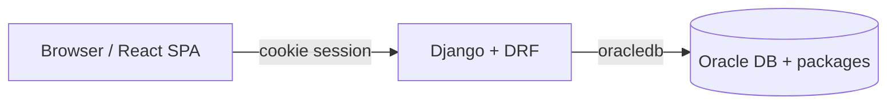

# Stack e infraestrutura

Inventário do que o Smarnet precisa para rodar, com plataformas, frameworks e faixas de versão declaradas no repositório.

> Versões “pinned” exatas no lockfile podem variar; use esta página como mapa e confira `backend/requirements/*.txt` e `frontend/package.json` / `package-lock.json` no momento do deploy.

## Visão geral

| Camada | Tecnologia | Versão / faixa |
|--------|------------|----------------|
| Runtime API | Python | **≥ 3.13** (`pyproject.toml` e imagem Docker `python:3.13-slim`) |
| Framework API | Django | `>=5.1,<6` |
| API HTTP | Django REST Framework | `>=3.15,<4` |
| OpenAPI | drf-spectacular | `>=0.28,<1` |
| Banco | Oracle Database | externo (host/service via `.env`) |
| Driver DB | `oracledb` (python-oracledb) | `>=2.0,<3` |
| Cliente nativo Oracle (Docker/Linux) | Instant Client | **19.25** (basiclite) |
| Frontend runtime | Node.js | **20** (Docker `node:20-alpine`) |
| UI framework | React | `^18.3.1` |
| Linguagem UI | TypeScript | `^5.8.3` |
| Bundler | Vite | `^5.4.19` |
| Roteamento | react-router-dom | `^6.30.1` |
| Estilo | Tailwind CSS | `^3.4.17` |
| Componentes | shadcn/ui + Radix UI | Radix vários `^1.x` / `^2.x` (ver `package.json`) |
| Ícones | lucide-react | `^0.462.0` |
| Servidor API (prod container) | Gunicorn | `>=22,<24` |
| Estáticos API | WhiteNoise | `>=6.7,<7` |
| Static frontend (prod image) | `serve` | **14** (global no Dockerfile) |

**Não usamos Bootstrap** (nem Bootstrap CSS/JS). O design system visual é Tailwind + tokens CSS + componentes no estilo shadcn/Radix.

---

## Infraestrutura necessária

### Obrigatório para o sistema funcionar

1. **Oracle Database** acessível (host, porta, service name, usuários/senhas).
2. **Backend Django** com dependências de `requirements/` e variáveis de `backend/.env`.
3. **Frontend** (dev com Vite ou build estático servido) apontando para a API (`VITE_DJANGO_API_URL`).
4. **CORS** liberando a origem do frontend no backend.
5. Em Linux/Docker com Instant Client: libs Oracle (`libaio`) e `ORACLE_HOME` / `LD_LIBRARY_PATH` (já tratados no `Dockerfile` raiz).

### Opcional / ferramentas

| Item | Uso |
|------|-----|
| Docker + Compose | Empacotar API e frontend |
| Oracle Instant Client | Requerido na imagem Linux da API; em Windows local pode usar thin mode do `oracledb` conforme setup |
| Django Admin (`/admin/`) | Operação/debug |
| Swagger (`/api/docs/`) | Explorar/contrato da API |

### Portas típicas

| Serviço | Porta |
|---------|-------|
| Django (`runserver` / Gunicorn) | **8000** |
| Frontend Vite (host) via Compose | **3000** → container **8080** |
| Vite local (fora do Compose) | conforme `npm run dev` (ex. 8080/8081/8082 se ocupado) |

---

## Backend — plataformas e bibliotecas

Fonte: `backend/requirements/base.txt`, `development.txt`, `pyproject.toml`.

### Runtime e framework

| Pacote | Faixa | Papel |
|--------|-------|--------|
| Python | `>=3.13` (projeto) | Runtime |
| Django | `>=5.1,<6` | Web framework |
| djangorestframework | `>=3.15,<4` | API REST |
| drf-spectacular | `>=0.28,<1` | OpenAPI / Swagger |
| django-environ | `>=0.11,<1` | Config via env |
| django-cors-headers | `>=4.6,<5` | CORS |
| oracledb | `>=2.0,<3` | Acesso Oracle |
| gunicorn | `>=22,<24` | WSGI produção |
| whitenoise | `>=6.7,<7` | Arquivos estáticos |

### Desenvolvimento / qualidade (`development.txt`)

| Pacote | Faixa | Papel |
|--------|-------|--------|
| ruff | `>=0.9.0` | Lint/format |
| mypy (+ django/drf stubs) | `>=1.14.0` | Tipagem |
| pytest, pytest-django, pytest-cov | `>=8.3` / `>=4.9` / `>=6.0` | Testes |
| import-linter | `>=2.1` | Regras de dependência entre camadas |

### Variáveis de ambiente (backend)

Ver `backend/.env.example`:

- `ORACLE_USER`, `ORACLE_PASSWORD`, `ORACLE_SMAR_USER`, `ORACLE_SMAR_PASSWORD`
- `ORACLE_HOST`, `ORACLE_PORT`, `ORACLE_SERVICE_NAME`, `ORACLE_CLIENT_PATH`
- `CORS_ALLOWED_ORIGINS` (lista separada por vírgula)
- `ALLOW_PUBLIC_REGISTER` (padrão `false`)

### Docker da API (`Dockerfile` raiz)

- Base: `python:3.12-slim` (duas stages)
- Instant Client **19.25** basiclite (x64 Linux)
- `libaio1t64`
- `pip install -r requirements/production.txt`
- CMD: `collectstatic` + **Gunicorn** em `0.0.0.0:8000`
- Compose: `extra_hosts` exemplo `dbdesenv` → IP interno; `env_file: backend/.env`

---

## Frontend — plataformas e bibliotecas

Fonte: `frontend/package.json`, `frontend/Dockerfile`, `docker-compose.dev.yml`.

### Core

| Pacote | Faixa | Papel |
|--------|-------|--------|
| Node.js | 20 (imagens Docker) | Runtime toolchain |
| React / react-dom | `^18.3.1` | UI |
| TypeScript | `^5.8.3` | Tipagem |
| Vite | `^5.4.19` | Dev server + build |
| `@vitejs/plugin-react-swc` | `^3.11.0` | Fast Refresh via SWC |
| react-router-dom | `^6.30.1` | Rotas SPA |

### Estilo e design system (não é Bootstrap)

| Pacote | Faixa | Papel |
|--------|-------|--------|
| tailwindcss | `^3.4.17` | Utility CSS |
| postcss / autoprefixer | `^8.5` / `^10.4` | Pipeline CSS |
| tailwindcss-animate | `^1.0.7` | Animações |
| class-variance-authority / clsx / tailwind-merge | `^0.7` / `^2.1` / `^2.6` | Variantes de classe |
| **Radix UI** (`@radix-ui/react-*`) | ver `package.json` | Primitivos acessíveis |
| lucide-react | `^0.462.0` | Ícones |
| next-themes | `^0.3.0` | Tema claro/escuro |
| sonner | `^1.7.4` | Toasts |

Padrão de componentes: **shadcn/ui** (código em `frontend/src/components/ui`), gerado/configurado via `frontend/components.json`. Catálogo in-app: `/design-system`. **Agentes:** usar só esses recursos — [`design-system.md`](./design-system.md).

### Dados, forms e UX

| Pacote | Faixa | Papel |
|--------|-------|--------|
| @tanstack/react-query | `^5.83.0` | Cache/fetch server state |
| axios | `^1.16.1` | HTTP (onde usado) |
| react-hook-form + @hookform/resolvers | `^7.61` / `^3.10` | Formulários |
| zod | `^3.25.76` | Validação de schemas |
| date-fns / react-day-picker | `^4.1` / `^8.10` | Datas |
| framer-motion | `^12.38.0` | Motion |
| recharts / chart.js / react-chartjs-2 | `^2.15` / `^4.5` / `^5.3` | Gráficos |
| @dnd-kit/* | `^6` / `^10` / `^3` | Drag and drop |
| cmdk / vaul / embla-carousel-react / input-otp | vários | Command palette, drawer, carousel, OTP |
| TipTap / TinyMCE | TipTap `^3.22+`, TinyMCE `^8.5` | Editores rich text |
| dompurify | `^3.4.3` | Sanitização HTML |
| flag-icons | `^7.5.0` | Bandeiras (ex. país) |
| react-select | `^5.10.2` | Selects avançados |
| i18n | JSON em `frontend/src/locales/` | pt-BR, en, es (sem lib i18next dedicada listada como core) |
| react-markdown + remark-gfm | `^10.1` / `^4.0` | Hub `/docs` (Markdown) |
| mermaid | `^11.17` | Diagramas Mermaid no hub `/docs` |

### Dev / teste frontend

| Pacote | Faixa | Papel |
|--------|-------|--------|
| eslint + typescript-eslint | `^9.32` / `^8.38` | Lint |
| vitest + Testing Library + jsdom | `^3.2` / `^16` / `^20` | Testes unitários |
| @playwright/test | `^1.57.0` | E2E |
| lovable-tagger | `^1.1.13` | Tooling de template |

### Variáveis de ambiente (frontend)

Ver `frontend/.env.example`:

- `VITE_DJANGO_API_URL` (ex. `http://localhost:8000/api`)
- `VITE_DJANGO_ADMIN_URL` (opcional)

### Docker do frontend

- **Produção** (`frontend/Dockerfile`): build com Node 20 → serve estático com `serve@14` na porta 8080.
- **Dev** (`docker-compose.dev.yml`): `node:20-alpine`, `npm ci --legacy-peer-deps`, Vite `--host 0.0.0.0 --port 8080`, volume para hot reload.

Compose produção (`docker-compose.yml`): mapa host `3000:8080`, build arg `VITE_DJANGO_API_URL`.

---

## Diagrama lógico

---

## Como atualizar este documento

1. Alterou dependência Python → `backend/requirements/*.txt` e esta tabela.
2. Alterou frontend → `frontend/package.json` (e lock) e esta tabela.
3. Alterou imagem/porta Compose → `Dockerfile*`, `docker-compose*.yml` e seções Docker acima.
4. Divergência Python 3.13 (projeto) vs 3.12 (Dockerfile) → resolver no código/imagem e refletir aqui.

Setup operacional: [admins/ambiente.md](../admins/ambiente.md).  
Arquitetura de camadas: [`ARCHITECTURE.md`](../../ARCHITECTURE.md).
